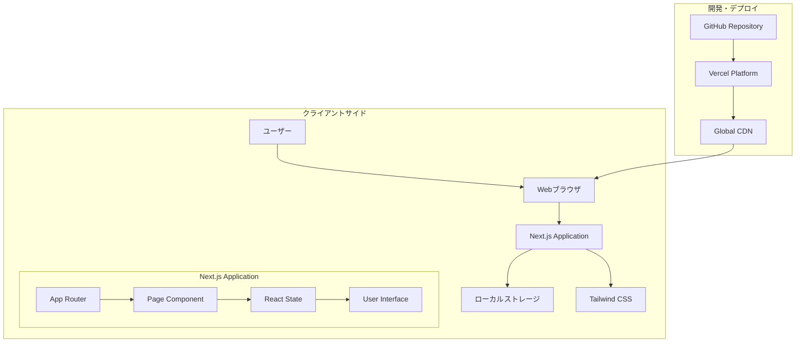
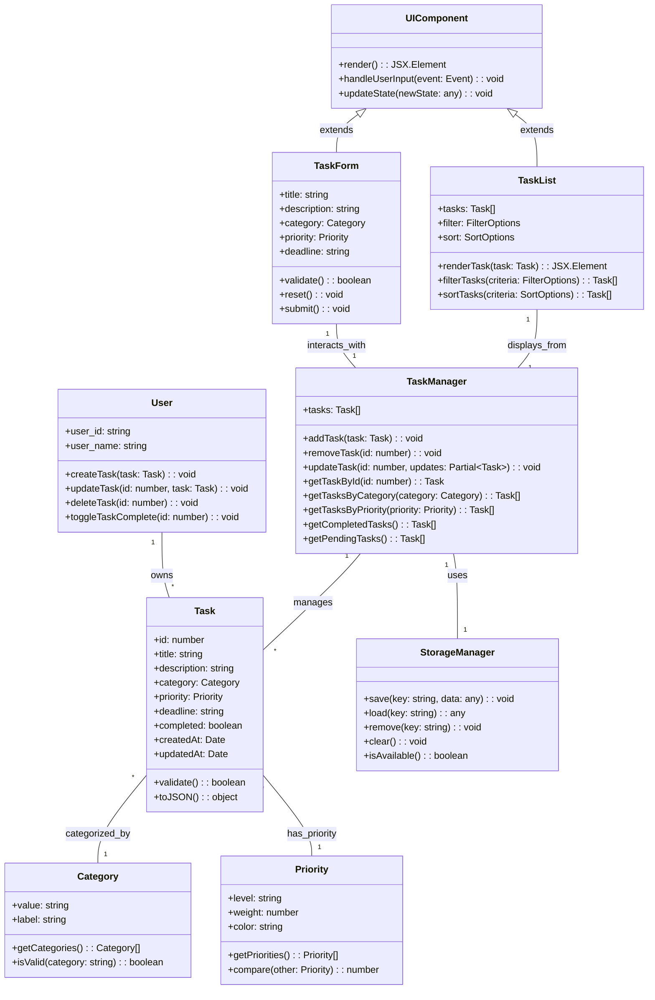
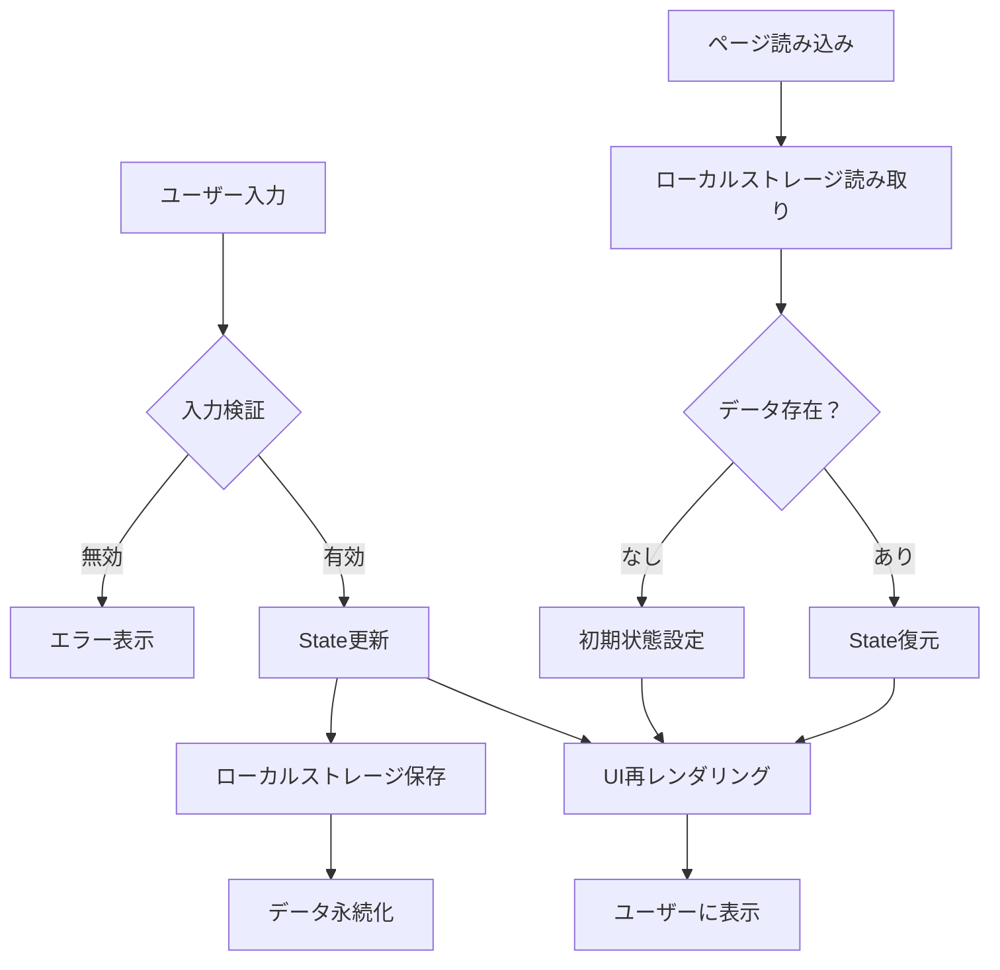
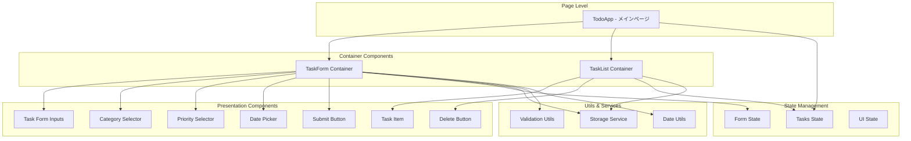

# TODO APP システム要件図

## 目次

1. [システム概要](#システム概要)
2. [システム要件](#システム要件)
3. [アーキテクチャ図](#アーキテクチャ図)
4. [クラス図](#クラス図)
5. [データフロー図](#データフロー図)
6. [コンポーネント構成](#コンポーネント構成)

---

## システム概要

TODO APPは、フロントエンド中心のシングルページアプリケーション（SPA）として設計されており、Next.js、React、TypeScript、Tailwind CSSを核技術として構築されています。

### 技術スタック
- **フロントエンド**: Next.js 15.5.2 + React + TypeScript
- **スタイリング**: Tailwind CSS
- **データ保存**: ブラウザローカルストレージ
- **ホスティング**: Vercel（推奨）

---

## システム要件

### 機能要件
- タスクのCRUD操作（作成、読取、更新、削除）
- タスクの完了状態管理
- カテゴリ・優先度・期限による分類機能
- リアルタイムなUI更新

### 非機能要件
- **パフォーマンス**: 1秒以内のレスポンス
- **ユーザビリティ**: 直感的で「ゆめかわいい」UI
- **互換性**: モダンブラウザ対応
- **保守性**: TypeScriptによる型安全性

---

## アーキテクチャ図

---

## クラス図

---

## データフロー図

---

## コンポーネント構成

### 主要コンポーネントの責務

#### TodoApp (メインコンポーネント)
- 全体の状態管理
- データの永続化
- 子コンポーネント間の連携

#### TaskForm Container
- フォームの状態管理
- 入力検証
- タスク作成処理

#### TaskList Container
- タスク一覧の表示
- タスク操作（完了/削除）
- フィルタリング・ソート

#### Storage Service
- ローカルストレージとの通信
- データのシリアライズ/デシリアライズ
- エラーハンドリング

---

## システム制約事項

### 技術制約
- JavaScriptが有効である必要がある
- モダンブラウザでの動作を前提
- ローカルストレージの容量制限

### 運用制約
- シングルユーザー使用
- オフライン動作（初回ロード後）
- デバイス間でのデータ同期なし

### セキュリティ考慮事項
- クライアントサイドでのデータ保存
- XSS対策（React標準）
- 入力値のサニタイゼーション