# TODO APP 方式設計書

## 目次

1. [システム概要](#システム概要)
2. [システム構成](#システム構成)
3. [アーキテクチャ設計](#アーキテクチャ設計)
4. [データベース設計](#データベース設計)
5. [API設計](#API設計)
6. [インターフェース設計](#インターフェース設計)
7. [セキュリティ設計](#セキュリティ設計)
8. [デプロイ構成](#デプロイ構成)

---

## システム概要

### 概要
TODO APPは、Next.js 15.5.2とReactを基盤とするシングルページアプリケーション（SPA）です。クライアントサイドでの完結したタスク管理システムとして設計され、ローカルストレージを使用してデータを永続化します。

### 技術選定理由
- **Next.js**: React基盤のフルスタックフレームワーク、SSR/SSG対応
- **TypeScript**: 型安全性による開発効率とバグ削減
- **Tailwind CSS**: ユーティリティファーストによる高速スタイリング
- **Local Storage**: サーバーレス環境での簡易データ永続化

### システム特性
- **パフォーマンス**: クライアントサイド処理による高速レスポンス
- **可用性**: オフライン動作可能（初回ロード後）
- **拡張性**: コンポーネントベース設計による機能追加容易性
- **保守性**: TypeScriptによる型安全性とコード品質

---

## システム構成

### 論理構成図

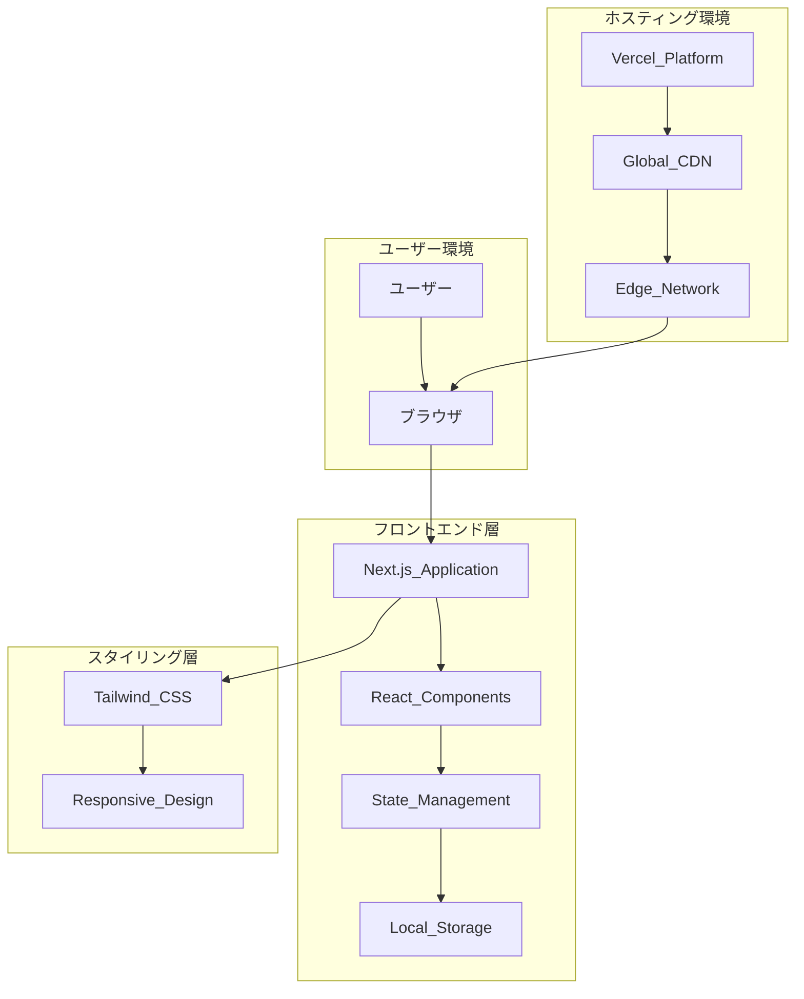

### 物理構成図

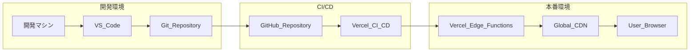

---

## アーキテクチャ設計

### レイヤー構成

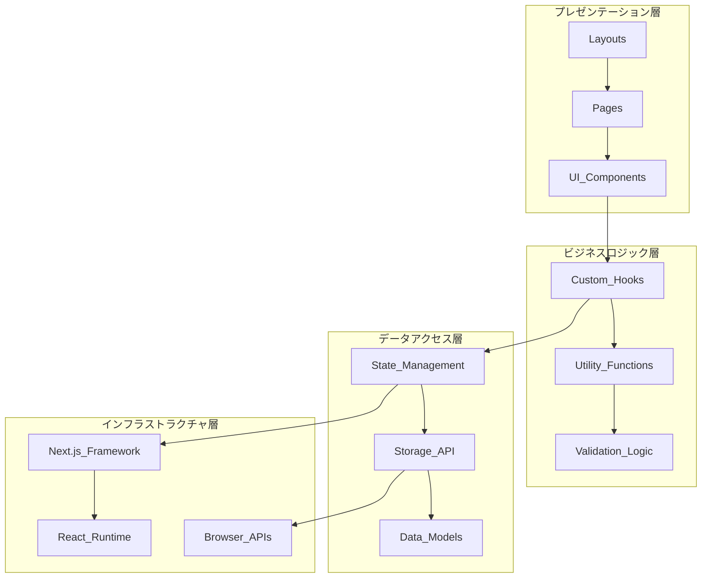

### コンポーネント設計

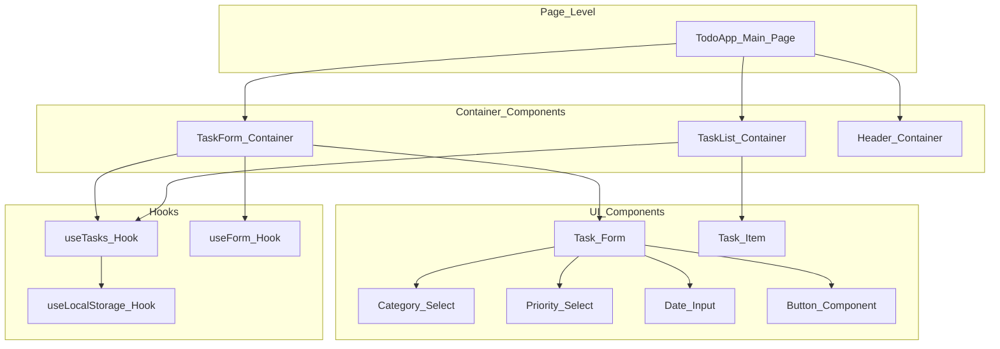

---

## データベース設計

### データモデル

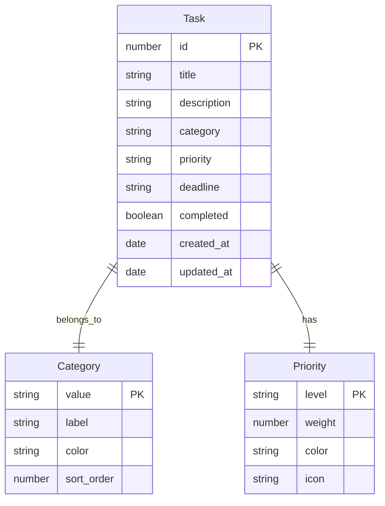

### TypeScript型定義

```typescript
// 基本データ型
type Priority = "高" | "中" | "低";
type Category = "仕事" | "プライベート" | "その他";

// メインタスク型
interface Task {
  id: number;
  title: string;
  description: string;
  category: Category;
  priority: Priority;
  deadline: string;
  completed: boolean;
  createdAt: Date;
  updatedAt: Date;
}

// カテゴリ設定型
interface CategoryConfig {
  value: Category;
  label: string;
  color: string;
  sortOrder: number;
}

// 優先度設定型
interface PriorityConfig {
  level: Priority;
  weight: number;
  color: string;
  icon: string;
}

// フォーム型
interface TaskFormData {
  title: string;
  description: string;
  category: Category;
  priority: Priority;
  deadline: string;
}

// ストレージ型
interface StorageData {
  tasks: Task[];
  settings: AppSettings;
  version: string;
}
```

### ローカルストレージ設計

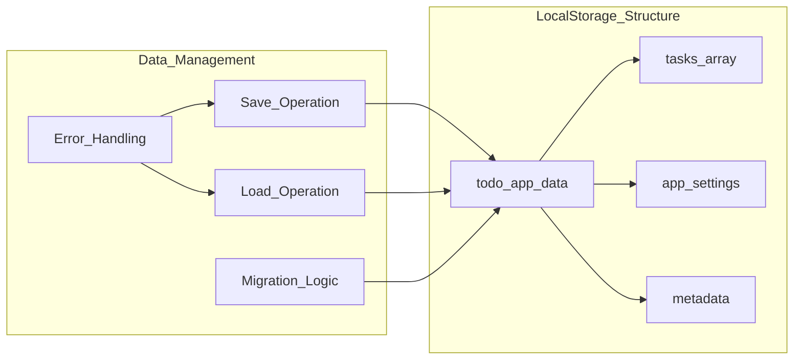

---

## API設計

### 内部API設計（フロントエンド）

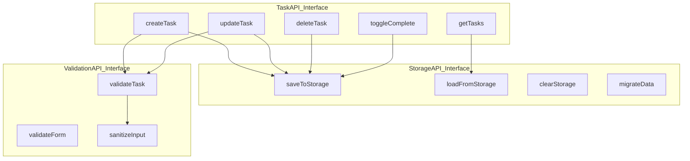

### API関数仕様

```typescript
// タスク管理API
interface TaskAPI {
  // タスク作成
  createTask(taskData: TaskFormData): Promise<Task>;
  
  // タスク更新
  updateTask(id: number, updates: Partial<Task>): Promise<Task>;
  
  // タスク削除
  deleteTask(id: number): Promise<void>;
  
  // タスク取得
  getTasks(): Promise<Task[]>;
  
  // 完了状態切り替え
  toggleComplete(id: number): Promise<Task>;
  
  // フィルタリング
  getTasksByCategory(category: Category): Promise<Task[]>;
  getTasksByPriority(priority: Priority): Promise<Task[]>;
  getCompletedTasks(): Promise<Task[]>;
  getPendingTasks(): Promise<Task[]>;
}

// ストレージAPI
interface StorageAPI {
  save<T>(key: string, data: T): Promise<void>;
  load<T>(key: string): Promise<T | null>;
  remove(key: string): Promise<void>;
  clear(): Promise<void>;
  exists(key: string): Promise<boolean>;
  getSize(): Promise<number>;
}

// バリデーションAPI
interface ValidationAPI {
  validateTask(task: TaskFormData): ValidationResult;
  validateTitle(title: string): boolean;
  validateDeadline(deadline: string): boolean;
  sanitizeInput(input: string): string;
}
```

---

## インターフェース設計

### ユーザーインターフェース設計

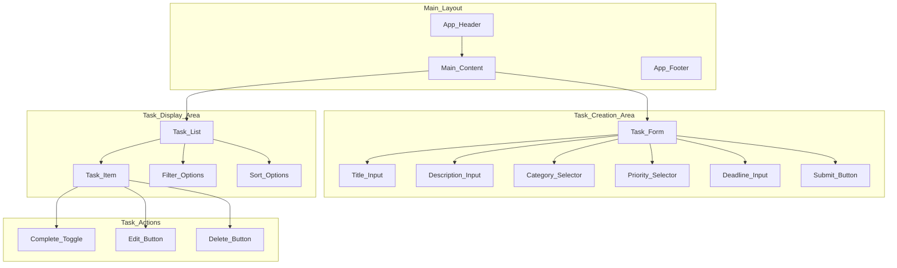

### レスポンシブデザイン

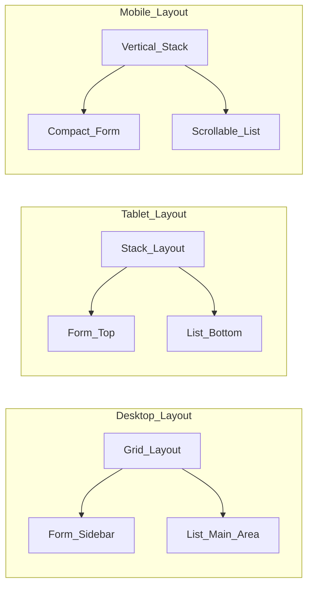

---

## セキュリティ設計

### セキュリティ対策

```mermaid
graph TB
    subgraph "Input_Security"
        InputValidation[入力検証]
        InputSanitization[入力無害化]
        XSSPrevention[XSS対策]
    end
    
    subgraph "Data_Security"
        LocalStorageEncryption[ローカルストレージ暗号化]
        DataValidation[データ検証]
        IntegrityCheck[整合性チェック]
    end
    
    subgraph "Client_Security"
        CSPHeaders[CSP_Headers]
        HTTPSOnly[HTTPS_Only]
        SecureCookies[Secure_Cookies]
    end
    
    subgraph "Code_Security"
        DependencyScanning[依存関係スキャン]
        StaticAnalysis[静的解析]
        VulnerabilityCheck[脆弱性チェック]
    end
    
    InputValidation --> InputSanitization
    InputSanitization --> XSSPrevention
    
    LocalStorageEncryption --> DataValidation
    DataValidation --> IntegrityCheck
    
    CSPHeaders --> HTTPSOnly
    HTTPSOnly --> SecureCookies
    
    DependencyScanning --> StaticAnalysis
    StaticAnalysis --> VulnerabilityCheck
```

### セキュリティ実装

```typescript
// 入力検証・無害化
class SecurityUtils {
  static validateInput(input: string): boolean {
    // 入力値の妥当性検証
    return /^[a-zA-Z0-9\s\u3040-\u309F\u30A0-\u30FF\u4E00-\u9FAF]*$/.test(input);
  }
  
  static sanitizeInput(input: string): string {
    // HTMLエスケープ
    return input
      .replace(/&/g, '&amp;')
      .replace(/</g, '&lt;')
      .replace(/>/g, '&gt;')
      .replace(/"/g, '&quot;')
      .replace(/'/g, '&#x27;');
  }
  
  static validateTaskData(task: TaskFormData): ValidationResult {
    const errors: string[] = [];
    
    if (!this.validateInput(task.title)) {
      errors.push('不正な文字が含まれています');
    }
    
    if (task.title.length > 100) {
      errors.push('タイトルが長すぎます');
    }
    
    return {
      isValid: errors.length === 0,
      errors
    };
  }
}

// CSP設定（next.config.js）
const cspHeader = `
  default-src 'self';
  script-src 'self' 'unsafe-eval' 'unsafe-inline';
  style-src 'self' 'unsafe-inline';
  img-src 'self' blob: data:;
  font-src 'self';
  object-src 'none';
  base-uri 'self';
  form-action 'self';
  frame-ancestors 'none';
  upgrade-insecure-requests;
`;
```

---

## デプロイ構成

### デプロイメントフロー

```mermaid
graph LR
    subgraph "開発フェーズ"
        LocalDev[ローカル開発]
        Testing[テスト実行]
        CodeReview[コードレビュー]
    end
    
    subgraph "CI_CD_Pipeline"
        GitCommit[Git_Commit]
        GitHubActions[GitHub_Actions]
        BuildProcess[ビルドプロセス]
        QualityCheck[品質チェック]
    end
    
    subgraph "デプロイメント"
        VercelDeploy[Vercel_Deploy]
        ProductionTest[本番テスト]
        Monitoring[監視開始]
    end
    
    LocalDev --> Testing
    Testing --> CodeReview
    CodeReview --> GitCommit
    
    GitCommit --> GitHubActions
    GitHubActions --> BuildProcess
    BuildProcess --> QualityCheck
    
    QualityCheck --> VercelDeploy
    VercelDeploy --> ProductionTest
    ProductionTest --> Monitoring
```

### 環境構成

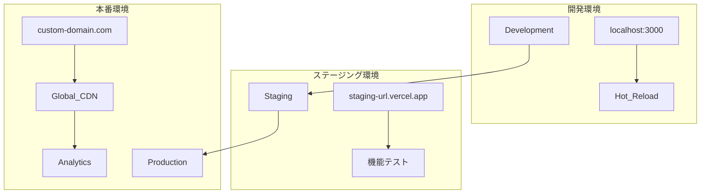

### ビルド・デプロイ設定

```typescript
// next.config.js
/** @type {import('next').NextConfig} */
const nextConfig = {
  output: 'export',
  trailingSlash: true,
  images: {
    unoptimized: true
  },
  env: {
    APP_VERSION: process.env.npm_package_version,
    BUILD_TIME: new Date().toISOString(),
  },
  headers: async () => [
    {
      source: '/(.*)',
      headers: [
        {
          key: 'X-Content-Type-Options',
          value: 'nosniff',
        },
        {
          key: 'X-Frame-Options',
          value: 'DENY',
        },
        {
          key: 'X-XSS-Protection',
          value: '1; mode=block',
        },
      ],
    },
  ],
};

module.exports = nextConfig;

// vercel.json
{
  "buildCommand": "npm run build",
  "outputDirectory": "out",
  "framework": "nextjs",
  "functions": {},
  "headers": [
    {
      "source": "/(.*)",
      "headers": [
        {
          "key": "Cache-Control",
          "value": "public, max-age=31536000, immutable"
        }
      ]
    }
  ]
}
```

### 監視・運用

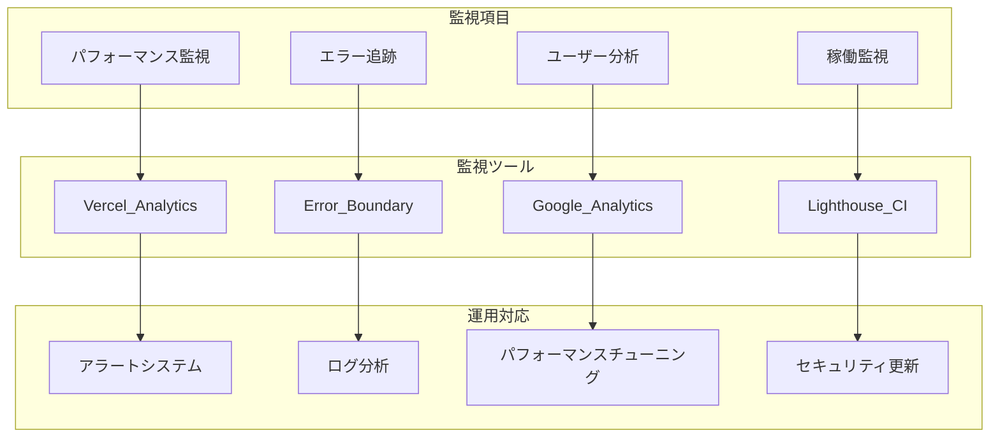
