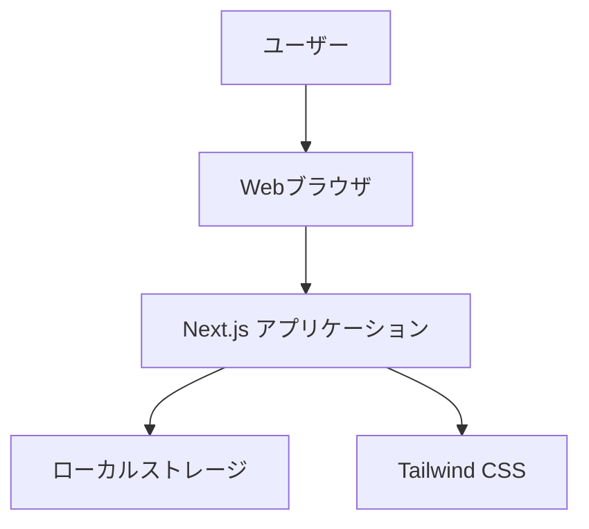

# TODO APP 要件定義書

## 目次

1. [概要](#概要)
2. [機能要件](#機能要件)
   - 2.1 [基本機能](#基本機能)
   - 2.2 [タスク管理機能](#タスク管理機能)
   - 2.3 [分類・整理機能](#分類・整理機能)
3. [非機能要件](#非機能要件)
   - 3.1 [性能要件](#性能要件)
   - 3.2 [ユーザビリティ要件](#ユーザビリティ要件)
   - 3.3 [技術要件](#技術要件)
4. [システム構成](#システム構成)
   - 4.1 [アーキテクチャ](#アーキテクチャ)
   - 4.2 [データ構造](#データ構造)
5. [ユーザーインターフェース](#ユーザーインターフェース)
   - 5.1 [画面構成](#画面構成)
   - 5.2 [デザイン方針](#デザイン方針)
6. [開発・運用要件](#開発・運用要件)
   - 6.1 [開発環境](#開発環境)
   - 6.2 [デプロイメント](#デプロイメント)
7. [付録](#付録)
   - 7.1 [用語集](#用語集)
   - 7.2 [参考資料](#参考資料)

---

## 概要

### プロジェクト概要

TODO APP は、ユーザーが日常的なタスクを効率的に管理するための Web アプリケーションです。直感的なインターフェースと「ゆめかわいい」デザインを特徴とし、タスクの作成、編集、削除、完了管理を中心とした機能を提供します。

### 目的

- ユーザーのタスク管理効率の向上
- 視覚的に魅力的な UI によるモチベーション向上
- シンプルで使いやすいタスク管理ツールの提供

### 対象ユーザー

- 個人のタスク管理を行いたいユーザー
- 視覚的に魅力的なアプリケーションを好むユーザー
- Web ブラウザでアクセス可能なツールを求めるユーザー

---

## 機能要件

### 基本機能

| ID  | 要件内容                                 | 優先度 |
| --- | ---------------------------------------- | ------ |
| F01 | ユーザーは新しいタスクを作成できる       | 高     |
| F02 | ユーザーは既存のタスクを編集できる       | 中     |
| F03 | ユーザーは不要なタスクを削除できる       | 高     |
| F04 | ユーザーはタスクを完了としてマークできる | 高     |
| F05 | ユーザーは全てのタスクを一覧で表示できる | 高     |

### タスク管理機能

| ID  | 要件内容                                           | 優先度 |
| --- | -------------------------------------------------- | ------ |
| F06 | ユーザーはタスクをカテゴリに分けて整理できる       | 中     |
| F07 | ユーザーはタスクに優先度を設定できる（高・中・低） | 中     |
| F08 | ユーザーはタスクに期限を設定できる                 | 中     |

### 分類・整理機能

- タスクは「仕事」「プライベート」「その他」のカテゴリに分類可能
- 優先度は「高」「中」「低」の 3 段階で設定可能
- 期限は日付形式で設定可能

---

## 非機能要件

### 性能要件

- **レスポンス時間**: ユーザー操作に対して 1 秒以内の応答
- **同時接続数**: 単一ユーザーでの使用を想定
- **データ保存**: ブラウザのローカルストレージを使用

### ユーザビリティ要件

- **直感的操作**: 説明なしで基本操作が可能
- **視覚的魅力**: 「ゆめかわいい」デザインテーマ
- **レスポンシブ**: モバイルデバイスでも利用可能

### 技術要件

- **ブラウザ対応**: モダンブラウザ（Chrome, Firefox, Safari, Edge）
- **JavaScript 有効**: クライアントサイドでの動作
- **インターネット接続**: 初回ロード時のみ必要

---

## システム構成

### アーキテクチャ



### データ構造

#### Task 型

```typescript
type Task = {
  id: number;
  title: string;
  description: string;
  category: Category;
  priority: Priority;
  deadline: string;
  completed: boolean;
};
```

#### Category 型

```typescript
type Category = "仕事" | "プライベート" | "その他";
```

#### Priority 型

```typescript
type Priority = "高" | "中" | "低";
```

---

## ユーザーインターフェース

### 画面構成

#### メイン画面

- ヘッダー: アプリケーションタイトル「TODO APP」
- 入力フォーム: タスク作成用のフォーム
- タスク一覧: 登録されたタスクの表示

#### 入力フォーム項目

1. タイトル（必須）
2. 説明（任意）
3. カテゴリ選択
4. 優先度選択
5. 期限設定
6. 追加ボタン

### デザイン方針

- **カラーパレット**: パステルピンク、パープル、ブルーのグラデーション
- **フォント**: 可読性の高いフォント
- **装飾**: 絵文字とアイコンの活用
- **レイアウト**: 丸みを帯びたデザイン要素
- **アニメーション**: ホバー効果とトランジション

---

## 開発・運用要件

### 開発環境

- **フレームワーク**: Next.js 15.5.2
- **言語**: TypeScript
- **スタイリング**: Tailwind CSS
- **開発ツール**: VS Code
- **バージョン管理**: Git

### デプロイメント

- **ホスティング**: Vercel（推奨）
- **ビルド**: Next.js 標準ビルドプロセス
- **環境**: Node.js 環境

---

## 付録

### 用語集

| 用語         | 説明                                                 |
| ------------ | ---------------------------------------------------- |
| タスク       | ユーザーが管理する作業項目                           |
| カテゴリ     | タスクの分類方法                                     |
| 優先度       | タスクの重要度レベル                                 |
| ゆめかわいい | パステルカラーを基調とした可愛らしいデザインスタイル |

### 参考資料

- [Next.js Documentation](https://nextjs.org/docs)
- [Tailwind CSS Documentation](https://tailwindcss.com/docs)
- [TypeScript Documentation](https://www.typescriptlang.org/docs)
- [React Documentation](https://react.dev)
